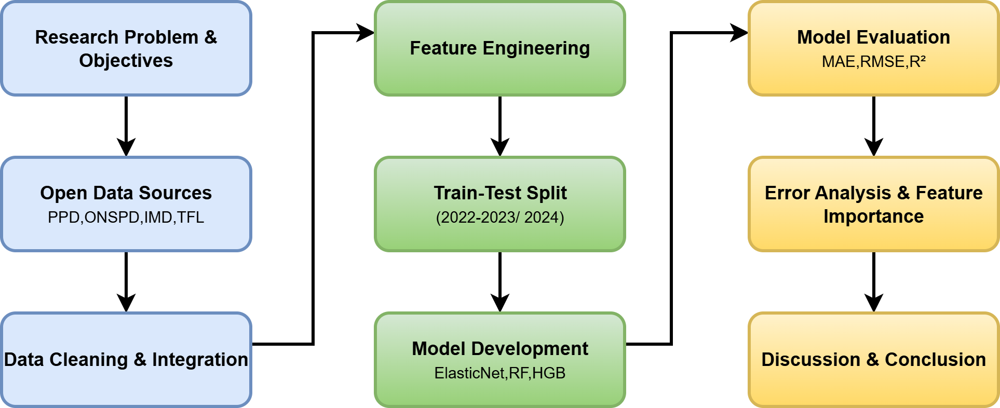
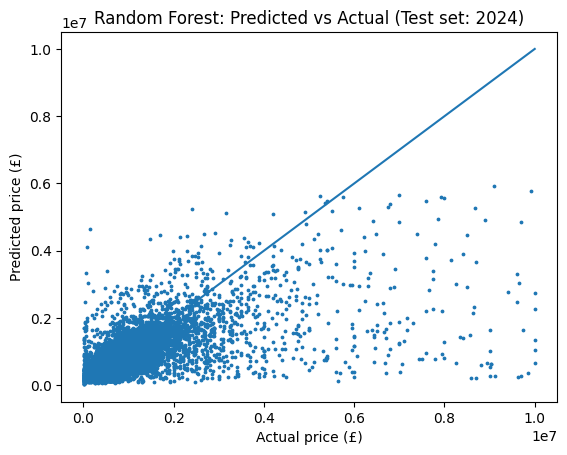
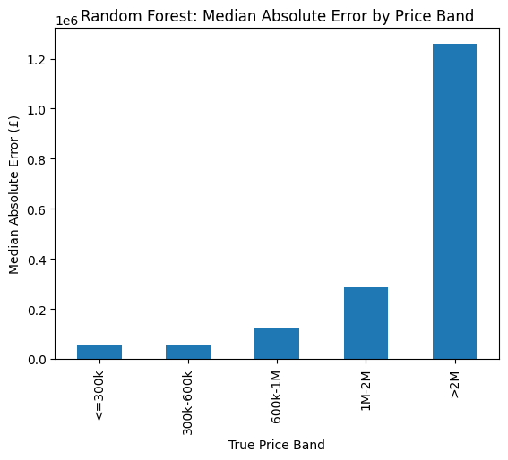
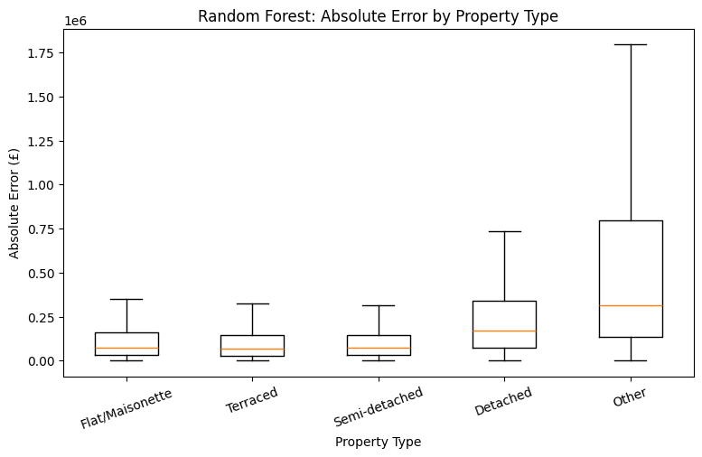
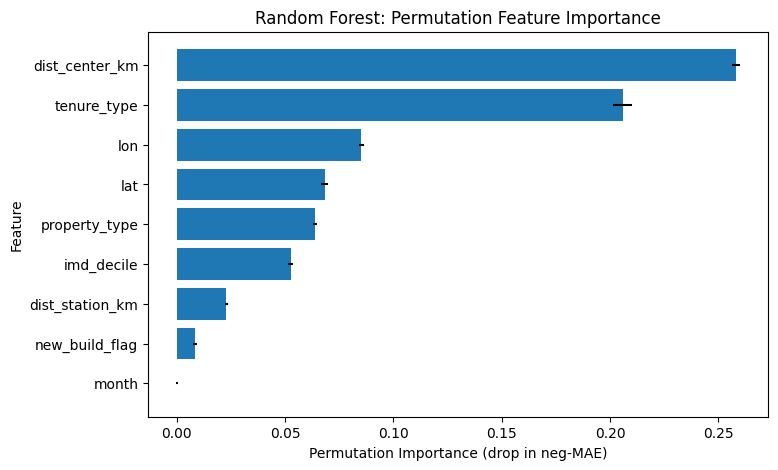

 # London House Price Prediction Using Machine Learning

An end-to-end machine learning project predicting residential property prices across London using property, geographic, transport and socio-economic data.

The project compares multiple regression models using a time-based validation strategy and investigates not only predictive performance, but also model errors and the factors influencing London property prices.

## Project Overview

Accurately predicting property prices in London is challenging because prices are influenced by property characteristics, location, accessibility and socio-economic conditions.

This project integrates multiple UK open datasets to build and evaluate machine learning models for London residential property price prediction.

Transactions from **2022–2023 were used for training**, while **2024 transactions were kept as an unseen test set**, providing a realistic temporal evaluation of how the models perform on future property transactions.



## Data Sources

The project combines data from several publicly available UK sources:

- UK residential property transaction data
- ONS Postcode Directory (ONSPD)
- Index of Multiple Deprivation (IMD)
- Transport for London (TfL) station data

The final modelling dataset incorporates property characteristics alongside spatial and socio-economic information.

Key features include:

- Property type
- New-build status
- Tenure type
- Latitude and longitude
- IMD decile
- Distance to nearest transport station
- Distance to Central London
- Month of transaction

Raw and processed datasets are not stored in this repository due to their large file sizes. Further information is available in the [`data`](data/) directory.

## Methodology

The project followed an end-to-end machine learning workflow:

1. Data collection and integration
2. Data cleaning and preprocessing
3. Feature engineering
4. Temporal train-test split
5. Model development and hyperparameter tuning
6. Model evaluation
7. Error analysis
8. Permutation feature importance

Three regression algorithms were compared:

- ElasticNet
- Random Forest
- Histogram Gradient Boosting

Property prices were log-transformed during modelling to reduce the effect of the highly skewed London housing market.

## Model Performance

Random Forest produced the strongest overall performance on the unseen 2024 test data.

| Model | MAE | RMSE | R² |
|---|---:|---:|---:|
| ElasticNet | £253,520.81 | £622,939.62 | 0.2094 |
| Random Forest | **£191,716.64** | **£502,547.67** | **0.4856** |
| HistGradientBoosting | £215,267.85 | £545,503.90 | 0.3937 |

The Random Forest model also achieved a **Median Absolute Error of £80,728.21**, with **33.09% of predictions falling within 10% of the actual sale price**.

## Prediction Performance

The predicted-versus-actual analysis shows that the model performs considerably better for properties in the more common price ranges, while prediction errors increase for very high-value properties.



## Error Analysis

Model performance was examined across different property price bands and property types rather than relying only on aggregate evaluation metrics.

### Error by Price Band



Prediction errors increase substantially for high-value properties, particularly properties valued above £2 million.

### Error by Property Type



The model performs considerably better for common property categories such as flats, terraced and semi-detached properties than for less common and higher-value categories.

## Feature Importance

Permutation feature importance was used to investigate which variables contributed most strongly to Random Forest predictions.



**Distance to Central London was the strongest predictor**, followed by tenure type. Geographic coordinates, property type and deprivation level also contributed substantially to predictive performance.

This highlights the importance of spatial and socio-economic factors when modelling London's housing market.

## Tools and Technologies

- Python
- Pandas
- NumPy
- Scikit-learn
- Matplotlib
- Machine Learning
- Feature Engineering
- Spatial Data Analysis
- Model Evaluation
- Permutation Feature Importance
- Google Colab / Jupyter Notebook

## Repository Structure

```text
London-House-Price-Prediction/
│
├── data/
│   └── README.md
│
├── images/
│   ├── error_by_price_band.png
│   ├── error_by_property_type.png
│   ├── feature_importance.png
│   ├── predicted_vs_actual.png
│   └── project_workflow.png
│
├── notebooks/
│   └── london_house_price_prediction.ipynb
│
├── report/
│   └── London_House_Price_Prediction_Dissertation.pdf
│
└── README.md
